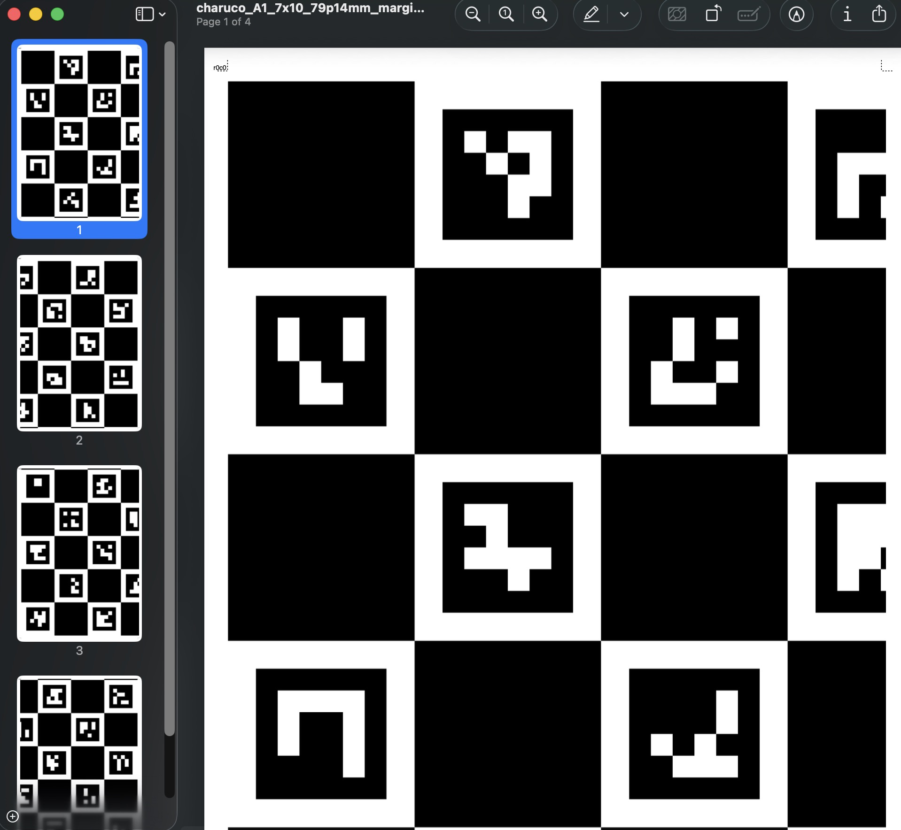

# Camera Calibration Helpers

Small set of scripts to support camera calibration tasks. Each script has its own section below.

## Setup

Create and activate a virtual environment:

```bash
python -m venv .venv
source .venv/bin/activate
python -m pip install -r requirements.txt
```

## Scripts

### ChArUco board generator

Generate print-ready ChArUco boards as single-page PDFs or tiled multi-page PDFs with
crop marks, tile labels, and a minimap for assembly.

<table>
  <tr>
    <td></td>
    <td></td>
  </tr>
</table>

### Generate a ChArUco board

Defaults:
- 10 x 7 squares
- 70 mm square size
- 0.7 marker proportion (49 mm markers)
- 300 DPI render
- PDF output by default

```bash
$ python scripts/generate_charuco.py --paper A1 --tile-paper A3 --margin 10 --squares-x 7 --squares-y 10

ChArUco board written:
  output: output/charuco_A1_7x10_79p14mm_margin10mm_tileA3_2x2tiles.pdf
  squares: 7 x 10
  square size (mm): 79.14
  marker proportion: 0.7
  marker size (mm): 55.39
  dictionary: DICT_4X4_50
  board size (mm): 554 x 791.42
  paper: A1 (main)
  tile paper: A3
  tiles: 2 x 2
  tile margin (mm): 10
  tile bleed (mm): 2
  tile printable (mm): 277 x 400
  tiled area (mm): 554 x 800
  minimap: output/charuco_A1_7x10_79p14mm_margin10mm_tileA3_2x2tiles_minimap.png
  pixels: 6544 x 9448
```

You can use `--paper` together with `--squares-x/--squares-y` to have the square
size computed to fit the paper (respecting margins).

Example for a paper-sized board (A3 @ 300 DPI):

```bash
python scripts/generate_charuco.py \
  --paper A3 \
  --square-size 70 \
  --marker-proportion 0.7 \
  --output charuco_A3.pdf
```

Outputs (default directory: `output/`):
- Full board PDF (auto-named unless `--output` is set).

### Tiled output (multi-page PDF)

Generate a large board size and tile it across smaller pages. Each page includes
crop marks and a tile label, plus a minimap PNG with cutlines.

```bash
python scripts/generate_charuco.py \
  --paper A1 \
  --tile-paper A3 \
  --margin 10 \
  --squares-x 8 \
  --squares-y 12
```

Tiling notes:
- `--tile-paper` requires `--paper` (the main board size).
- `--margin` applies per tile page.
- `--tile-bleed` controls the overflow beyond crop marks (default: 2mm).
- `--crop-mark` controls crop mark length (default: 5mm).
- A minimap PNG is written next to the PDF with `_minimap.png` suffix.

### Printing notes

- Laser printer preferred, matte paper
- 300 DPI or higher
- Disable any printer scaling (no “fit to page”)
- Print a reference ruler and verify scale
- After printing, measure square size; target error < 0.5 mm
- Mount to a flat surface; do not laminate
