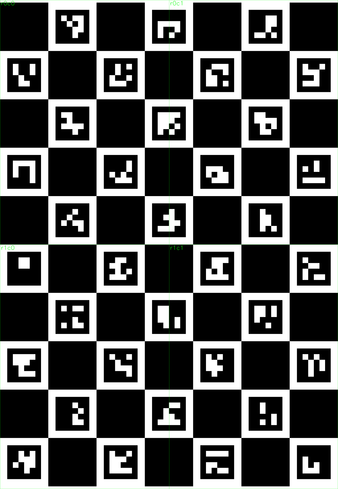
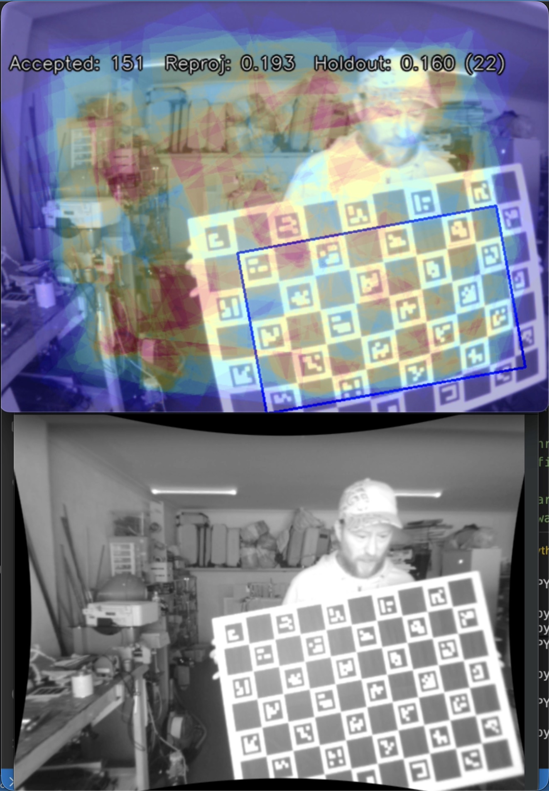

# Camera Calibration Helpers

Set of scripts to support camera calibration tasks (specifically using ps3eye cameras)

## Scripts

### `charuco_board/generate_charuco.py`

Generate print-ready ChArUco boards as single-page PDFs or tiled multi-page PDFs with crop marks, tile labels, and a minimap for assembly. Use this to create the physical calibration target that the rest of the tools expect.

<table>
  <tr>
    <td></td>
    <td></td>
  </tr>
</table>

### `ps3eye_tools/test_ps3eye_focus.py`

Small utilities for quick sanity checks with a PS3 Eye camera. Use them to confirm device access, dial in exposure, and judge focus before running calibration.


### `live_calibration/live_charuco_calibration.py`

Interactive capture tool for collecting ChArUco observations in real time. It shows a live preview with an optional coverage heatmap, accepts frames that meet your detection/quality thresholds, and periodically recalibrates to give immediate feedback on reprojection error and coverage gaps.

See demo here: https://www.instagram.com/p/DUfEMg_k39c/




## Setup

Create and activate a virtual environment:

```bash
python -m venv .venv
source .venv/bin/activate
python -m pip install -r requirements.txt
```
