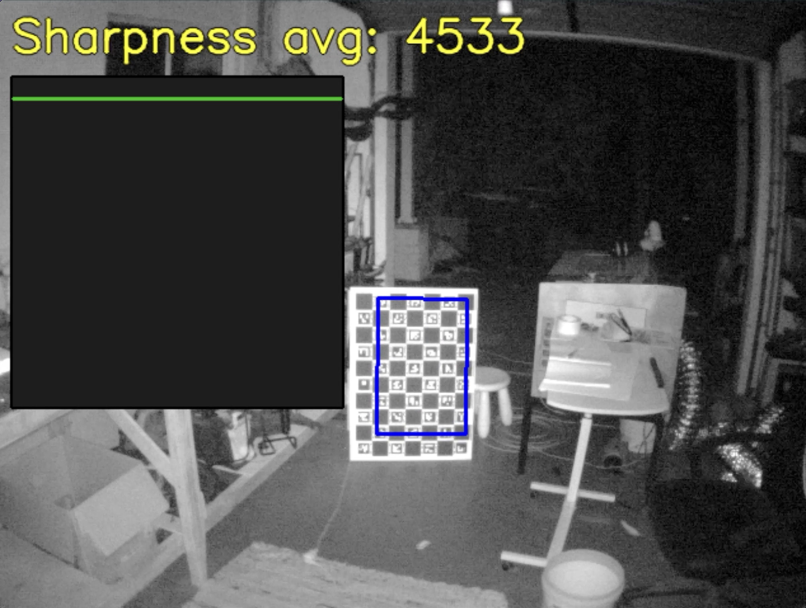

# PS3 Eye Preview Tools

Small utilities for quick sanity checks with a PS3 Eye camera. Use them to confirm device access, dial in exposure, and judge focus before running calibration. These scripts have no CLI options; edit constants near the top of each file.

## Focus helper (`test_ps3eye_focus.py`)



Purpose: helps you set focus by detecting a checkerboard and showing a rolling sharpness score. It locks onto the checkerboard region after a brief “locking” period, then tracks sharpness in that region so you can adjust focus consistently.

```bash
python scripts/ps3eye_tools/test_ps3eye_focus.py
```

## Preview (`test_ps3eye_preview.py`)

Purpose: a minimal live view to verify the camera is streaming and to tune exposure/gain/FPS. It shows a raw or debayered preview and nothing else.

```bash
python scripts/ps3eye_tools/test_ps3eye_preview.py
```


## Dependency: PS3Eye Python module

These tools require the `ps3eye` Python module built from the PS3 Eye driver repo:

- https://github.com/soswow/PS3Eye-library

Build the Python module (from that repo):

```bash
python -m pip install pybind11 numpy
cmake -S . -B build -DBUILD_PYTHON=ON -DCMAKE_PREFIX_PATH="$(python -m pybind11 --cmakedir)"
cmake --build build
```

After building, ensure Python can import `ps3eye` by adding the build directory to `PYTHONPATH`:

```bash
export PYTHONPATH="/path/to/PS3Eye-Driver-MacOS-Silicon/build:${PYTHONPATH}"
```

You can also run these scripts from the driver repo `build/` directory so the module is discoverable.